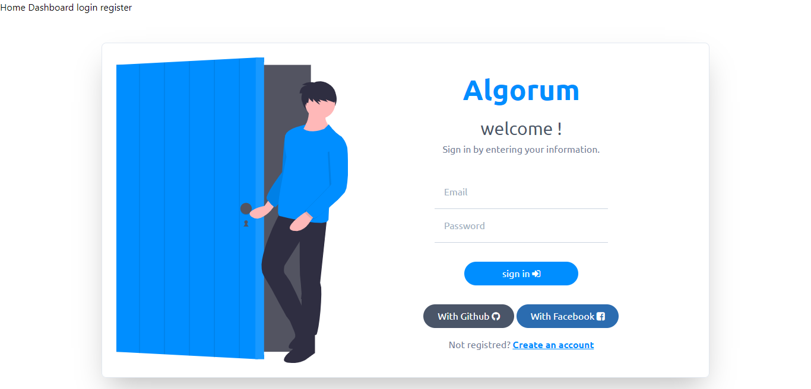
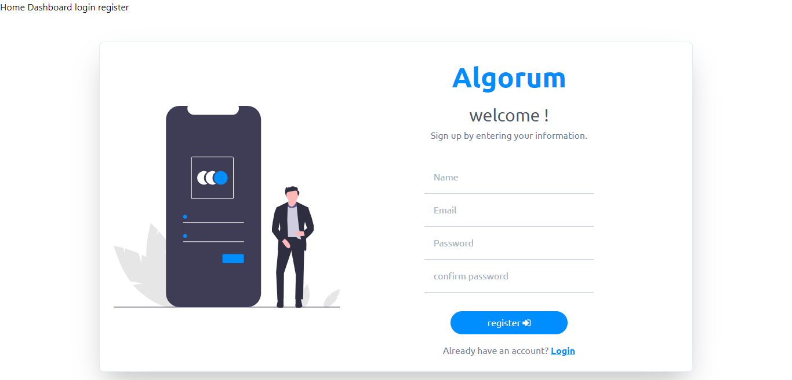
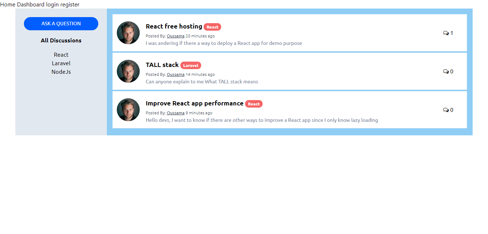
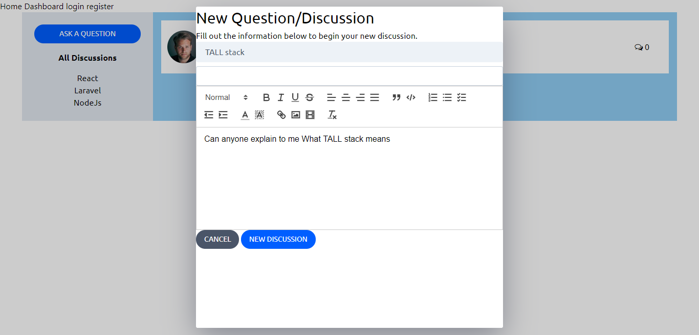
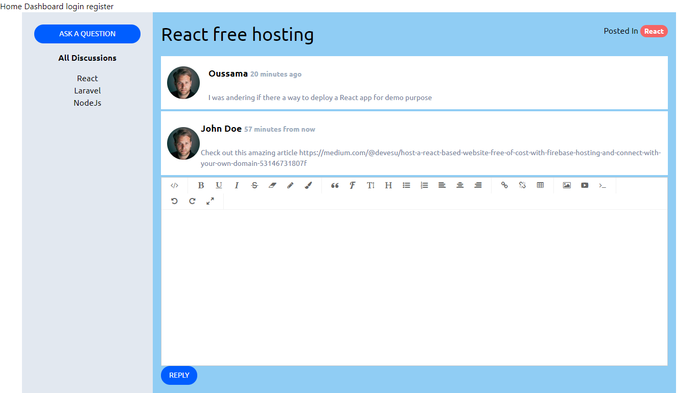

# Forum 🎯
Forum website made using Laravel & VueJs

## Features 🔥
✔️ Authentication with Github & Facebook
✔️ Authentication with JWT
✔️ SPA (Single Page Application) with vue-router
✔️ Use Laravel with vueJs & Tailwindcss
✔️ API
✔️ State management with Vuex
✔️ Notifications

<details>
<summary>Screenshots</summary>








</details>

## TODO 📝
* [ ] Improve app design (I focused only on Laravel)
* [ ] Implement sign out feature
* [ ] Make navbar dynamic with user state
* [ ] Improve auth middleware
    - When user signup redirect to dashboard instead of login
    - When user is already signein redirect automatically to dashboard

## Tools & Languages 🛠️
- [tailwindcss](https://github.com/laravel-frontend-presets/tailwindcss) a utility-first CSS framework for
rapidly building custom designs.
- [VueJs](https://vuejs.org/v2/guide/) the javascript framework choosed for the frontend
- [Vuex](https://vuex.vuejs.org/) for state management
- [Vue Router](https://router.vuejs.org/) for routing & making our app a
- [vform](https://github.com/cretueusebiu/vform) to handle Laravel back-end validation in Vue
- [vue-js-modal](https://github.com/euvl/vue-js-modal) 🍕 Simple to use, highly customizable, mobile friendly Vue.js modal. 
- [vue2-editor](https://github.com/davidroyer/vue2-editor) An easy-to-use but yet powerful and customizable rich text editor powered by Quill.js and Vue.js
- [vue-spinner](https://github.com/greyby/vue-spinner) vuejs ready to use loading spinners
- [jwt-auth](https://github.com/tymondesigns/jwt-auth) Authentication system
- [js-cookie](https://github.com/js-cookie/js-cookie) for saving the user authentication token in cookies
- [Laravel](https://laravel.com/) Php framework used for backend
- [VSCode](https://code.visualstudio.com/) as a text editor

## Usage 📋

``` bash
# 1. clone the repo
$ git clone https://github.com/oussamabouchikhi/forum.git

# 2. Go to app's directory
$ cd forum/

# 3. Install dependencies
$ npm install
$ composer install

# 4. Rename .env.example file to .env

# 5. Generate key
$ php artisan key:generate

# 6. run project (run both commands in separate tabs at the same time)
$ php artisan serve
$ npm run watch
```

Create a database named ```forum``` or name it as you like but don't forget to edit it in ```.env``` file ```DB_DATABASE=your_database_name```

```.env``` 
>__notes:__ 
>1. You need first to create github & facebook applications to get  these info
>2. Facebook callback url must be https when you configure your app
```
GITHUB_CLIENT_ID=your_github_client_id
GITHUB_CLIENT_SECRET=your_github_client_secret
GITHUB_CALLBACK=http://localhost:8000/login/github/callback

FACEBOOK_APP_ID=your_facebook_app_id
FACEBOOK_APP_SECRET=your_facebook_app_secret
FACEBOOK_CALLBACK=http://localhost:8000/login/facebook/callback
```
```config/services.php```
```
'github' => [
    'client_id' => env('GITHUB_CLIENT_ID'),
    'client_secret' => env('GITHUB_CLIENT_SECRET'),
    'redirect' => env('GITHUB_CALLBACK'),
],

'facebook' => [
    'client_id' => env('FACEBOOK_APP_ID'),
    'client_secret' => env('FACEBOOK_APP_SECRET'),
    'redirect' => env('FACEBOOK_CALLBACK'),
]
```

## Contributing 💡
Pull requests are welcome, feel free to ```fork``` this repo.

## License 📄
This project is open sourced unde the [MIT license](https://opensource.org/licenses/MIT).
